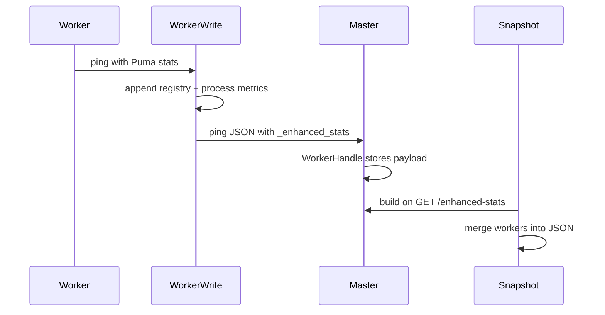

# Puma::Enhanced::Stats

Gem to collect, enrich, and expose extended statistics from Puma's `control_app` in **Rails 7+** applications.

## Overview

`puma-enhanced-stats` tracks **in-flight HTTP requests** per worker and exposes them together with **Puma thread-pool stats** and **process metrics** (RSS, CPU) through a stable JSON contract.

| Capability | Description |
|------------|-------------|
| In-flight requests | Method, path, remote IP, and optional session fields while a request is active |
| Puma stats | Backlog, running threads, pool capacity, max threads, requests count |
| Process metrics | RSS (bytes) and CPU percent via `ps` on Linux/macOS |
| Cluster aggregation | Master merges enhanced stats synced from each worker ping |
| Terminal CLI | Live dashboard, watch mode, host top view (`puma-enhanced-stats`) |

The gem activates when loaded via Bundler. No `puma.rb` entry is required for defaults.

## Requirements

- Ruby >= 3.0
- Rails >= 7.0, < 8
- Puma >= 8.0
- Terminal: ANSI colors recommended for the CLI (use `--no-color` in CI)

## Installation

Add the gem to your Gemfile:

```ruby
gem "puma-enhanced-stats", github: "smart-sgisistemas/puma-enhanced-stats", tag: "v0.2.1"
```

Or track `main` / a branch:

```ruby
gem "puma-enhanced-stats", github: "smart-sgisistemas/puma-enhanced-stats"
```

Then run:

```bash
bundle install
```

The Railtie registers two middleware layers: `RequestStartMiddleware` (outermost) sets `HTTP_X_REQUEST_START` when absent; `RequestsMiddleware` (innermost) tracks in-flight requests. Session middleware runs between them on the request path, so `rack.session` remains available for session field extractors.

## Control app setup

Enhanced stats are served by Puma's control server. Enable it in `config/puma.rb`:

```ruby
# config/puma.rb
workers 2 # optional — cluster mode

activate_control_app "tcp://127.0.0.1:9293", { auth_token: "secret" }
```

The control app listens on the configured bind address (here `9293`). Requests without a valid `token` query parameter receive **403 Forbidden**.

## Querying stats

### HTTP (control app)

```bash
curl "http://127.0.0.1:9293/enhanced-stats?token=secret"
```

### pumactl

```bash
bundle exec pumactl -S tmp/puma.state enhanced-stats
```

`pumactl` uses the state file and control socket configured by Puma; authentication follows the same rules as other control commands.

For a live terminal dashboard, see [CLI](#cli).

## CLI

The gem installs **`puma-enhanced-stats`**, a full-terminal dashboard that consumes the same JSON as `curl` and `pumactl enhanced-stats`. It does not load Rails — only the control app must be running (`activate_control_app`).

```bash
bundle exec puma-enhanced-stats -S tmp/puma.state --top -w
```

**Prerequisites:** Puma with `activate_control_app` (see [Control app setup](#control-app-setup)).

### What it shows

| Block | Flag | Description |
|-------|------|-------------|
| **HEADER** | always | Gem/Puma/Ruby versions, mode (`single` / `cluster`), sync interval, collection time |
| **SYSTEM** | `--top` | Host load average, CPU (usr/sys/idle + bar), memory, swap |
| **PROCESSES** | `--top` | Table of Puma master + worker PIDs with `%CPU`, `%MEM`, RSS, thread pool, backlog — sorted by `--sort` |
| **SUMMARY** | always | Cluster-wide backlog, threads in use, pool capacity free, in-flight count |
| **WORKER** | always | Per-worker pool bars + in-flight request table (one box per worker, stacked) |
| **FOOTER** | `-w` | Refresh interval (`sync_interval_seconds` from server) and hints |

**PROCESSES (`--top`)** is a `top`-style process list for the Puma processes on the machine where you run the CLI. Rows come from enhanced-stats worker PIDs plus the master PID (from the state file). `%CPU` / `%MEM` / `RSS` are enriched via `ps`; `RUN/CAP`, `BACKLOG`, and `POOL` come from each worker's Puma stats in the JSON. The `M` marker is the cluster master. Use `--sort cpu` (or `rss`, `backlog`) to reorder this table and the worker boxes below.

Bars use color thresholds: green below 70%, yellow 70–90%, red above 90% or when backlog is positive. Box titles show **`[WARN]`** / **`[CRIT]`** when limits are stressed. Custom `request` / `session` fields from `enhanced_stats` in `puma.rb` appear as extra columns (wide terminal) or nested `└` lines under each request (narrow terminal).

### Layout order

| # | Section | When |
|---|---------|------|
| 1 | HEADER | always |
| 2 | SYSTEM | `--top` |
| 3 | PROCESSES | `--top` |
| 4 | SUMMARY | always |
| 5 | WORKER 0, 1, … (stacked; side-by-side with `--compact`) | always |
| 6 | FOOTER | `-w` |

Without `--top`: HEADER → SUMMARY → WORKER(s) → FOOTER (if `-w`).

### Example — cluster with `--top --watch` (wide terminal)

Custom fields in `puma.rb`:

```ruby
enhanced_stats do
  request :shop_id
  request :api_version
  session :user_id
  session :tenant_slug
end
```

```bash
bundle exec puma-enhanced-stats -S tmp/puma.state --top -w
```

```
╔═ PUMA ENHANCED STATS ─ v0.2.1 ══════════════════════════════════════╗
║ Mode cluster │ Puma 8.0.2 │ Ruby 3.2.2 │ Sync 5s │ Collected 14:32:05 ║
╚═══════════════════════════════════════════════════════════════════════╝

┌─ SYSTEM ─ app-web-01 ──────────────────────────────────── 14:32:07 ─┐
│ Load   1.42   1.18   0.95        (1 / 5 / 15 min)                   │
│ CPU    usr 23%  sys 8%  idle 69%  [███████░░░░░░░░░░░░░░░░░░░░░░] 31% │
│ Memory 6.2 GiB / 16 GiB  [████████░░░░░░░░░░░░░░░░░░░░░░░░] 39%     │
│ Swap   128 MiB / 2 GiB   [█░░░░░░░░░░░░░░░░░░░░░░░░░░░░░░]  6%     │
└───────────────────────────────────────────────────────────────────────┘

┌─ PROCESSES (--top) ─ sorted by cpu ─────────────── refresh 5s ──────┐
│  PID     %CPU  %MEM     RSS  RUN/CAP  BACKLOG  POOL  W#               │
│  41235   42.7   2.5   398M    5/0        2       0    1              │
│  41234   18.2   2.6   412M    3/2        0       2    0              │
│  41233    0.3   0.8   128M      -         -       -    M              │
└───────────────────────────────────────────────────────────────────────┘

┌─ SUMMARY ─────────────────────────────────────────────────────────────┐
│ Workers reporting   2 / 2                                             │
│ Requests in-flight  3          Dropped total  0                       │
│ Backlog (global)    2          [████░░░░░░░░░░░░░░░░░░░░░░░░░░░░] WARN│
│ Threads in use      8 / 10     [████████████████░░░░░░░░░░░░░░░░] 80% │
│ Pool capacity free  2 / 10     [████░░░░░░░░░░░░░░░░░░░░░░░░░░░░] 20% │
└───────────────────────────────────────────────────────────────────────┘

┌─ WORKER 0 ─ pid 41234 ─ synced 2s ago ──────────────────────────────┐
│ Threads   3 / 5   [████████████░░░░░░░░░░░░░░░░░░░░] 60%            │
│ Capacity  2 / 5   [████████░░░░░░░░░░░░░░░░░░░░░░░░] 40%            │
│ Backlog   0       [░░░░░░░░░░░░░░░░░░░░░░░░░░░░░░░░] ok             │
│ CPU       18.2%   [████░░░░░░░░░░░░░░░░░░░░░░░░░░░░]                │
│ RSS       412 MiB [████████░░░░░░░░░░░░░░░░░░░░░░░░] 41% of host    │
│ Registry  2 / 100  keep_longest                                       │
├───────────────────────────────────────────────────────────────────────┤
│ IN-FLIGHT (2)                                                         │
│ ELAPSED  METHOD  PATH              REMOTE     SHOP_ID  API   USER  TENANT │
│ 45.0s    GET     /reports/export   10.0.0.12  BR-001  v2    42    acme    │
│ 12.3s    POST    /api/v1/orders    10.0.0.8   BR-001  v2    17    acme    │
└───────────────────────────────────────────────────────────────────────┘

┌─ WORKER 1 ─ pid 41235 ─ synced 2s ago ──────────────── [WARN] ──────┐
│ Threads   5 / 5   [████████████████████████████████████] 100% saturated │
│ Capacity  0 / 5   [░░░░░░░░░░░░░░░░░░░░░░░░░░░░░░░░] 0%             │
│ Backlog   2       [████░░░░░░░░░░░░░░░░░░░░░░░░░░░░░░] queue          │
│ CPU       42.7%   [████████░░░░░░░░░░░░░░░░░░░░░░░░░░]                │
│ RSS       398 MiB [███████░░░░░░░░░░░░░░░░░░░░░░░░░░░] 39% of host    │
│ Registry  1 / 100  keep_longest                                       │
├───────────────────────────────────────────────────────────────────────┤
│ IN-FLIGHT (1)                                                         │
│ ELAPSED  METHOD  PATH      REMOTE     SHOP_ID  API   USER  TENANT     │
│  3.1s    GET     /health  127.0.0.1  BR-002  v2    99    acme        │
└───────────────────────────────────────────────────────────────────────┘

┌─ FOOTER ──────────────────────────────────────────────────────────────┐
│ Refresh 5s (sync_interval) │ Ctrl+C quit │ resize: SIGWINCH redraw   │
└───────────────────────────────────────────────────────────────────────┘
```

### Example — narrow terminal (nested overflow)

When the terminal is too narrow for flat columns, extra fields appear nested under each request:

```
┌─ WORKER 0 ─ pid 41234 ─ synced 2s ago ──────────────────────────────┐
│ Threads   3 / 5   [████████████░░░░░░░░] 60%                          │
│ Backlog   0       [░░░░░░░░░░░░░░░░░░░░] ok                           │
├───────────────────────────────────────────────────────────────────────┤
│ IN-FLIGHT (2)                                                         │
│ ELAPSED  METHOD  PATH                                                  │
│ 45.0s    GET     /reports/export                                       │
│   └ remote_ip: 10.0.0.12                                               │
│   └ shop_id: BR-001                                                    │
│   └ api_version: v2                                                    │
│   └ session.user_id: 42                                                │
│   └ session.tenant_slug: acme-corp                                     │
│ 12.3s    POST    /api/v1/orders                                        │
│   └ remote_ip: 10.0.0.8                                                │
│   └ shop_id: BR-001                                                    │
│   └ api_version: v2                                                    │
│   └ session.user_id: 17                                                │
│   └ session.tenant_slug: acme-corp                                     │
└───────────────────────────────────────────────────────────────────────┘
```

### Example — compact grid (`--compact`)

Two workers side by side (requires ≥ 120 columns and at most 2 workers):

```bash
bundle exec puma-enhanced-stats -S tmp/puma.state --top -w --compact
```

```
┌─ WORKERS ─────────────────────────────────────────────────────────────┐
│ ┌─ W0 pid 41234 ──────────────┐  ┌─ W1 pid 41235 ─── [WARN] ────────┐ │
│ │ Threads 3/5 [████████░░] 60%│  │ Threads 5/5 [████████████] 100% │ │
│ │ Backlog 0  ok               │  │ Backlog 2  queue                │ │
│ │ CPU 18.2%  RSS 412 MiB      │  │ CPU 42.7%  RSS 398 MiB          │ │
│ ├─────────────────────────────┤  ├─────────────────────────────────┤ │
│ │ IN-FLIGHT (2)               │  │ IN-FLIGHT (1)                   │ │
│ │ 45.0s GET /reports/export   │  │ 3.1s GET /health                │ │
│ │  └ shop_id: BR-001 …        │  │  └ shop_id: BR-002 …            │ │
│ └─────────────────────────────┘  └─────────────────────────────────┘ │
└───────────────────────────────────────────────────────────────────────┘
```

### Example — single mode (no `--top`, snapshot)

```bash
bundle exec puma-enhanced-stats -S tmp/puma.state
```

```
╔═ PUMA ENHANCED STATS ─ v0.2.1 ════════════════════════════════════════╗
║ Mode single │ Puma 8.0.2 │ Ruby 3.0.7 │ Sync 5s │ Collected 14:32:05  ║
╚═══════════════════════════════════════════════════════════════════════╝

┌─ SUMMARY ─────────────────────────────────────────────────────────────┐
│ Workers reporting   1 / 1                                             │
│ Requests in-flight  1          Dropped total  0                       │
│ Backlog (global)    0          [░░░░░░░░░░░░░░░░░░░░░░░░░░░░░░░░] ok  │
│ Threads in use      1 / 5      [████░░░░░░░░░░░░░░░░░░░░░░░░░░░░] 20% │
│ Pool capacity free  4 / 5      [████████████████░░░░░░░░░░░░░░░░] 80% │
└───────────────────────────────────────────────────────────────────────┘

┌─ WORKER 0 ─ pid 8842 ─ live ──────────────────────────────────────────┐
│ Threads   1 / 5   [████░░░░░░░░░░░░░░░░░░░░░░░░░░░░] 20%              │
│ Capacity  4 / 5   [████████████████░░░░░░░░░░░░░░░░] 80%              │
│ Backlog   0       [░░░░░░░░░░░░░░░░░░░░░░░░░░░░░░░░] ok               │
│ CPU       4.1%    [█░░░░░░░░░░░░░░░░░░░░░░░░░░░░░░░]                  │
│ RSS       186 MiB [███░░░░░░░░░░░░░░░░░░░░░░░░░░░░░]                  │
├───────────────────────────────────────────────────────────────────────┤
│ IN-FLIGHT (1)                                                         │
│ ELAPSED  METHOD  PATH                                                 │
│  2.8s    GET     /slow                                                │
│   └ remote_ip: 127.0.0.1                                              │
│   └ session.user_id: 7                                                │
└───────────────────────────────────────────────────────────────────────┘
```

### Example — special states

Worker not yet synced in cluster:

```
┌─ WORKER 2 ─ pid 41236 ─ [CRIT] not synced ────────────────────────────┐
│ Last ping   never                                                     │
│ Threads     - / -   [░░░░░░░░░░░░░░░░░░░░░░░░░░░░░░░░] n/a            │
│ Hint        waiting for _enhanced_stats ping (sync 5s)                │
└───────────────────────────────────────────────────────────────────────┘
```

Registry full with truncation:

```
┌─ WORKER 0 ─ pid 41234 ─ synced 5s ago ──────────────── [WARN] ──────┐
│ Registry  100 / 100  keep_longest  full                               │
│ Dropped   3 worker  │  12 summary                                     │
├───────────────────────────────────────────────────────────────────────┤
│ IN-FLIGHT (100)                                            [trunc]    │
│ ELAPSED  METHOD  PATH                                                 │
│ 45.0s    GET     /reports/export/very/long/path/truncated…            │
│   └ shop_id: BR-001                                                   │
│   └ session.user_id: 42                                               │
│ … +95 more requests                                                   │
└───────────────────────────────────────────────────────────────────────┘
```

### Commands

| Task | Command |
|------|---------|
| One-shot snapshot | `bundle exec puma-enhanced-stats -S tmp/puma.state` |
| Live refresh | `bundle exec puma-enhanced-stats -S tmp/puma.state -w` |
| With host top | `bundle exec puma-enhanced-stats -S tmp/puma.state --top -w` |
| HTTP control URL | `bundle exec puma-enhanced-stats --url http://127.0.0.1:9293 -T secret` |
| TCP control socket | `bundle exec puma-enhanced-stats -C tcp://127.0.0.1:9293 -T secret` |
| Raw JSON | `bundle exec puma-enhanced-stats -S tmp/puma.state --json \| jq '.summary'` |
| Single worker | `bundle exec puma-enhanced-stats -S tmp/puma.state --worker 1` |
| Sort by CPU | `bundle exec puma-enhanced-stats -S tmp/puma.state --top --sort cpu` |
| Compact grid | `bundle exec puma-enhanced-stats -S tmp/puma.state --compact` |
| CI / plain text | `bundle exec puma-enhanced-stats -S tmp/puma.state --no-color` |

### Flags

| Flag | Description |
|------|-------------|
| `-S`, `--state PATH` | Puma state file (same as `pumactl -S`) |
| `-C`, `--control-url URL` | Control bind (`tcp://127.0.0.1:9293`) |
| `--url URL` | HTTP control URL (`http://127.0.0.1:9293`) |
| `-T`, `--token TOKEN` | Control app auth token |
| `-w`, `--watch` | Auto-refresh using `meta.sync_interval_seconds` from the server |
| `--top` | Show **SYSTEM** and **PROCESSES** blocks |
| `--compact` | Two-column worker grid (≥ 120 columns; max 2 workers) |
| `--json` | Print raw enhanced-stats JSON |
| `--no-color` | Disable ANSI colors |
| `--worker N` | Show only worker index `N` |
| `--sort FIELD` | Sort workers and PROCESSES: `cpu`, `rss`, `backlog`, or `index` (default) |
| `-h`, `--help` | Usage |

With `-w`, the screen clears and redraws on each poll; resizing the terminal triggers an immediate redraw (`SIGWINCH` on Unix/macOS).

## Usage

### Zero-config

With only the Gemfile entry, the gem uses built-in defaults:

- Request fields: `remote_ip`, `method`, `path_info`
- `request_limit` 100, `limit_policy` `:keep_longest`, `sync_interval` 5 seconds

### Custom configuration

Declare `enhanced_stats` in `config/puma.rb` to customize field extractors and limits:

```ruby
enhanced_stats do
  request :path do |env|
    env["PATH_INFO"]
  end

  session :user_id
  session :tenant_slug do |session|
    session.dig("current_tenant", "slug")
  end

  request_limit 100
  limit_policy :keep_longest
  sync_interval 5
  max_field_length 256
end
```

When declared, the block is required.

### Defaults

| DSL | Default |
|-----|---------|
| `request` | `remote_ip`, `method`, `path_info` |
| `session` | disabled |
| `request_limit` | `100` |
| `limit_policy` | `:keep_longest` |
| `sync_interval` | `5` (seconds; sets Puma `worker_check_interval` in cluster mode, reported in JSON `meta`) |
| `max_field_length` | `256` |

### Field extractors

Both `request` and `session` are read at request entry (when the request is registered as in-flight).

| DSL | Source | Block argument | Stored as |
|-----|--------|----------------|-----------|
| `request` | Rack `env` | `env` | top-level keys on the entry (`method`, `path_info`, …) |
| `session` | `env["rack.session"]` | session hash | nested under `"session"` |

Built-in `request` fields:

| Name | Extracted from |
|------|----------------|
| `remote_ip` | `env["action_dispatch.remote_ip"]` or `env["REMOTE_ADDR"]` |
| `method` | `env["REQUEST_METHOD"]` |
| `path_info` | `env["SCRIPT_NAME"]` + `env["PATH_INFO"]` (no query string) |

Built-in `session` fields read keys from `env["rack.session"]`. Use a block for derived values:

```ruby
session :tenant_slug do |session|
  session.dig("current_tenant", "slug")
end
```

### Limit policies

| Policy | Behavior when the registry is full |
|--------|--------------------------------------|
| `:keep_longest` (default) | Evicts the newest in-flight entry and increments `dropped_count` for the current sync interval |
| `:reject_new` | Skips registration for new requests and increments `dropped_count` for the current sync interval |

`dropped_count` and `truncated` in each worker's `requests.meta` report events since the last worker ping (cluster) or last snapshot read (single), not cumulative process lifetime.

## JSON response

The payload follows [schema/enhanced-stats-v1.json](schema/enhanced-stats-v1.json). Top-level keys:

| Key | Description |
|-----|-------------|
| `schema_version` | Always `1` |
| `meta` | Collection timestamp, gem/Puma/Ruby versions, mode (`single` or `cluster`), `sync_interval_seconds` |
| `summary` | Aggregated worker and in-flight request counters (`workers_reporting` counts workers with non-null `synced_at`) |
| `workers` | Per-worker Puma stats, process metrics, and in-flight request items |

Worker `synced_at` is the last cluster ping carrying `_enhanced_stats` (`null` until the first ping). In single mode it is the snapshot collection time.

Example (truncated):

```json
{
  "schema_version": 1,
  "meta": {
    "collected_at": "2026-06-12T10:00:00Z",
    "gem_version": "0.2.1",
    "puma_version": "8.0.2",
    "ruby_version": "3.2.2",
    "mode": "cluster",
    "sync_interval_seconds": 5
  },
  "summary": {
    "workers_total": 2,
    "workers_reporting": 2,
    "requests_in_flight": 1,
    "requests_dropped_total": 0
  },
  "workers": [{
    "index": 0,
    "pid": 12345,
    "synced_at": "2026-06-12T10:00:05Z",
    "puma": {
      "backlog": 0,
      "running": 1,
      "pool_capacity": 5,
      "max_threads": 5,
      "requests_count": 10
    },
    "process": {
      "rss_bytes": 256000000,
      "cpu_percent": 12.5
    },
    "requests": {
      "meta": {
        "count": 1,
        "request_limit": 100,
        "limit_policy": "keep_longest",
        "truncated": false,
        "dropped_count": 0
      },
      "items": [{
        "id": "abc",
        "started_at": "2026-06-12T09:59:20Z",
        "elapsed_ms": 45000,
        "method": "GET",
        "path_info": "/reports",
        "remote_ip": "127.0.0.1",
        "session": { "user_id": "42" }
      }]
    }
  }]
}
```

See [spec/fixtures/enhanced-stats-v1.sample.json](spec/fixtures/enhanced-stats-v1.sample.json) for a full sample.

## Operating modes

| Mode | How enhanced stats are collected |
|------|----------------------------------|
| **single** | Master reads the live in-flight registry and samples process metrics on demand |
| **cluster** | Each worker injects `_enhanced_stats` into its ping payload; the master merges via `WorkerHandle` |

Cluster sync flow:



In cluster mode, `sync_interval` overrides Puma's `worker_check_interval`, controlling how often workers ping the master (and carry `_enhanced_stats`). `before_worker_boot` clears the in-flight registry when a worker process starts.

## Platform notes

- **Process metrics** (`rss_bytes`, `cpu_percent`) are sampled via `ps` on **Linux and macOS** only. On other platforms (e.g. Windows), values are `null`.
- **Rails required.** The Railtie inserts `RequestStartMiddleware` at the stack head and appends `RequestsMiddleware` as the innermost layer so session middleware runs earlier on the request path and `rack.session` is available for session field extractors.
- **Activation** is controlled by including or omitting the gem in the Gemfile; there is no `enabled` flag.

## Development

Clone the repository and install dependencies:

```bash
bin/setup
bundle exec rake
```

Coverage (100% line + branch):

```bash
COVERAGE=true bundle exec rake spec:coverage
# report: coverage/index.html
```

Or use Docker:

```bash
docker build -t puma-enhanced-stats:dev .
docker run --rm -v "$(pwd):/app" -w /app puma-enhanced-stats:dev bundle exec rake
```

Generate API documentation:

```bash
bundle exec yard
# output: doc/
```

Interactive console:

```bash
bin/console
```

## Contributing

Bug reports and pull requests are welcome on GitHub at https://github.com/smart-sgisistemas/puma-enhanced-stats.

## License

The gem is available as open source under the terms of the [MIT License](https://opensource.org/licenses/MIT).
