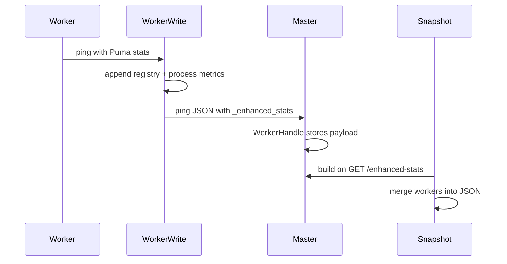

# Puma::Enhanced::Stats

Gem to collect, enrich, and expose extended statistics from Puma's `control_app` in **Rails 7+** applications.

## Overview

`puma-enhanced-stats` tracks **in-flight HTTP requests** per worker and exposes them together with **Puma thread-pool stats** and **process metrics** (RSS, CPU) through a stable JSON contract.

| Capability | Description |
|------------|-------------|
| In-flight requests | Method, path, remote IP, and optional session fields while a request is active |
| Puma stats | Backlog, running threads, pool capacity, max threads, requests count |
| Process metrics | RSS (bytes) and CPU percent via `ps` on Linux/macOS |
| Cluster aggregation | Master merges enhanced stats synced from each worker ping |

The gem activates when loaded via Bundler. No `puma.rb` entry is required for defaults.

## Requirements

- Ruby >= 3.0
- Rails >= 7.0, < 8
- Puma >= 6.0

## Installation

Add the gem to your Gemfile:

```ruby
gem "puma-enhanced-stats", github: "smart-sgisistemas/puma-enhanced-stats"
```

Then run:

```bash
bundle install
```

The Railtie inserts stats middleware after the Rails session store automatically.

## Control app setup

Enhanced stats are served by Puma's control server. Enable it in `config/puma.rb`:

```ruby
# config/puma.rb
workers 2 # optional — cluster mode

activate_control_app "tcp://127.0.0.1:9293", { auth_token: "secret" }
```

The control app listens on the configured bind address (here `9293`). Requests without a valid `token` query parameter receive **403 Forbidden**.

## Querying stats

### HTTP (control app)

```bash
curl "http://127.0.0.1:9293/enhanced-stats?token=secret"
```

### pumactl

```bash
bundle exec pumactl -S tmp/puma.state enhanced-stats
```

`pumactl` uses the state file and control socket configured by Puma; authentication follows the same rules as other control commands.

## Usage

### Zero-config

With only the Gemfile entry, the gem uses built-in defaults:

- Request fields: `remote_ip`, `method`, `path_info`
- `request_limit` 100, `limit_policy` `:keep_longest`, `sync_interval` 5 seconds

### Custom configuration

Declare `enhanced_stats` in `config/puma.rb` to customize field extractors and limits:

```ruby
enhanced_stats do
  request :path do |env|
    env["PATH_INFO"]
  end

  session :user_id
  session :tenant_slug do |session|
    session.dig("current_tenant", "slug")
  end

  request_limit 100
  limit_policy :keep_longest
  sync_interval 5
  max_field_length 256
end
```

When declared, the block is required.

### Defaults

| DSL | Default |
|-----|---------|
| `request` | `remote_ip`, `method`, `path_info` |
| `session` | disabled |
| `request_limit` | `100` |
| `limit_policy` | `:keep_longest` |
| `sync_interval` | `5` (seconds; sets Puma `worker_check_interval` in cluster mode, reported in JSON `meta`) |
| `max_field_length` | `256` |

### Field extractors

Both `request` and `session` are read at request entry (when the request is registered as in-flight).

| DSL | Source | Block argument | Stored as |
|-----|--------|----------------|-----------|
| `request` | Rack `env` | `env` | top-level keys on the entry (`method`, `path_info`, …) |
| `session` | `env["rack.session"]` | session hash | nested under `"session"` |

Built-in `request` fields:

| Name | Extracted from |
|------|----------------|
| `remote_ip` | `env["action_dispatch.remote_ip"]` or `env["REMOTE_ADDR"]` |
| `method` | `env["REQUEST_METHOD"]` |
| `path_info` | `env["SCRIPT_NAME"]` + `env["PATH_INFO"]` (no query string) |

Built-in `session` fields read keys from `env["rack.session"]`. Use a block for derived values:

```ruby
session :tenant_slug do |session|
  session.dig("current_tenant", "slug")
end
```

### Limit policies

| Policy | Behavior when the registry is full |
|--------|--------------------------------------|
| `:keep_longest` (default) | Evicts the newest in-flight entry and increments `dropped_count` |
| `:reject_new` | Skips registration for new requests and increments `dropped_count` |

## JSON response

The payload follows [schema/enhanced-stats-v1.json](schema/enhanced-stats-v1.json). Top-level keys:

| Key | Description |
|-----|-------------|
| `schema_version` | Always `1` |
| `meta` | Collection timestamp, gem/Puma/Ruby versions, mode (`single` or `cluster`), `sync_interval_seconds` |
| `summary` | Aggregated worker and in-flight request counters (`workers_reporting` counts workers with non-null `synced_at`) |
| `workers` | Per-worker Puma stats, process metrics, and in-flight request items |

Worker `synced_at` is the last cluster ping carrying `_enhanced_stats` (`null` until the first ping). In single mode it is the snapshot collection time.

Example (truncated):

```json
{
  "schema_version": 1,
  "meta": {
    "collected_at": "2026-06-12T10:00:00Z",
    "gem_version": "0.1.0",
    "puma_version": "8.0.2",
    "ruby_version": "3.2.2",
    "mode": "cluster",
    "sync_interval_seconds": 5
  },
  "summary": {
    "workers_total": 2,
    "workers_reporting": 2,
    "requests_in_flight": 1,
    "requests_dropped_total": 0
  },
  "workers": [{
    "index": 0,
    "pid": 12345,
    "synced_at": "2026-06-12T10:00:05Z",
    "puma": {
      "backlog": 0,
      "running": 1,
      "pool_capacity": 5,
      "max_threads": 5,
      "requests_count": 10
    },
    "process": {
      "rss_bytes": 256000000,
      "cpu_percent": 12.5
    },
    "requests": {
      "meta": {
        "count": 1,
        "request_limit": 100,
        "limit_policy": "keep_longest",
        "truncated": false,
        "dropped_count": 0
      },
      "items": [{
        "id": "abc",
        "started_at": "2026-06-12T09:59:20Z",
        "elapsed_ms": 45000,
        "method": "GET",
        "path_info": "/reports",
        "remote_ip": "127.0.0.1",
        "session": { "user_id": "42" }
      }]
    }
  }]
}
```

See [spec/fixtures/enhanced-stats-v1.sample.json](spec/fixtures/enhanced-stats-v1.sample.json) for a full sample.

## Operating modes

| Mode | How enhanced stats are collected |
|------|----------------------------------|
| **single** | Master reads the live in-flight registry and samples process metrics on demand |
| **cluster** | Each worker injects `_enhanced_stats` into its ping payload; the master merges via `WorkerHandle` |

Cluster sync flow:



In cluster mode, `sync_interval` overrides Puma's `worker_check_interval`, controlling how often workers ping the master (and carry `_enhanced_stats`). `before_worker_boot` clears the in-flight registry when a worker process starts.

## Platform notes

- **Process metrics** (`rss_bytes`, `cpu_percent`) are sampled via `ps` on **Linux and macOS** only. On other platforms (e.g. Windows), values are `null`.
- **Rails required.** Middleware is inserted by the Railtie immediately after the configured session store so `rack.session` is available for session field extractors.
- **Activation** is controlled by including or omitting the gem in the Gemfile; there is no `enabled` flag.

## Development

Clone the repository and install dependencies:

```bash
bin/setup
bundle exec rake
```

Or use Docker:

```bash
docker build -t puma-enhanced-stats:dev .
docker run --rm -v "$(pwd):/app" -w /app puma-enhanced-stats:dev bundle exec rake
```

Generate API documentation:

```bash
bundle exec yard
# output: doc/
```

Interactive console:

```bash
bin/console
```

## Contributing

Bug reports and pull requests are welcome on GitHub at https://github.com/smart-sgisistemas/puma-enhanced-stats.

## License

The gem is available as open source under the terms of the [MIT License](https://opensource.org/licenses/MIT).
