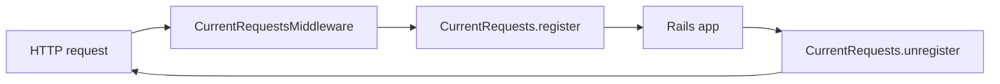
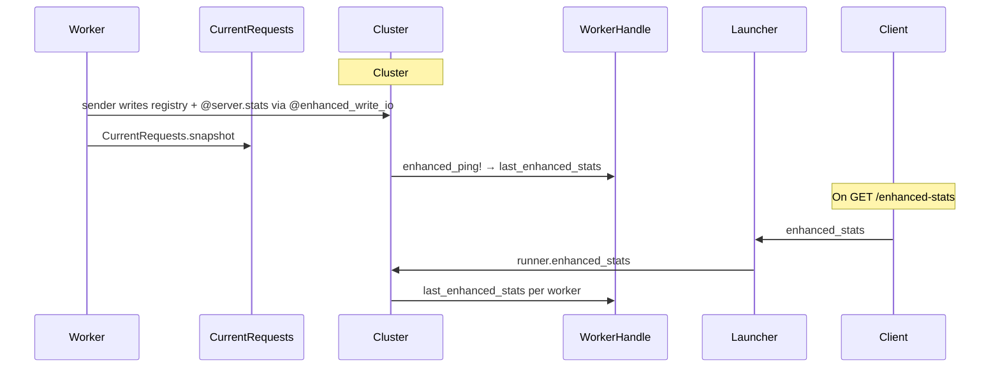
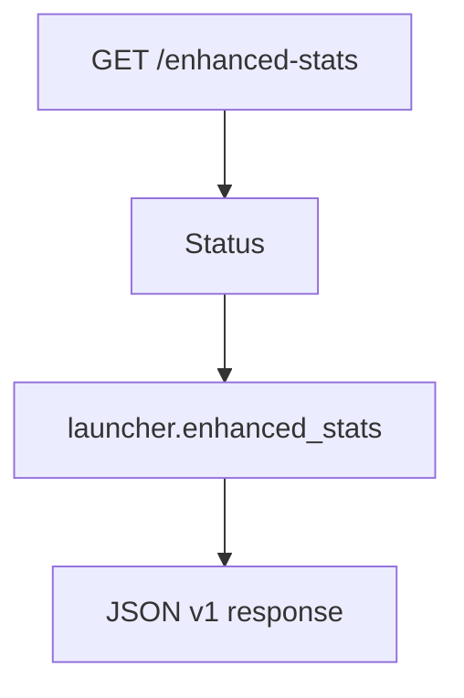

# Architecture

How **puma-enhanced-stats** integrates with Puma and Rails without modifying native Puma stats output.

## Components

| Component | Role |
|-----------|------|
| `Railtie` | Inserts `CurrentRequestsMiddleware` innermost on the Rails stack |
| `CurrentRequestsMiddleware` | `register` on entry, `unregister` in `ensure` |
| `CurrentRequests` | Thread-safe in-flight registry (Singleton per worker) |
| `Configuration` / `DSL` | Limits, policies, field extractors from `puma.rb` |
| `Launcher` | `enhanced_stats` → `@runner.enhanced_stats` (like `stats`) |
| `Snapshot` | Builds JSON v1 (`schema_version`, `meta`, `summary`, `workers`) |
| `Cluster` | Pipe IO, reader thread → `enhanced_ping!` |
| `WorkerHandle` | `@last_enhanced_stats` via `enhanced_ping!` (mirrors `@last_status` / `ping!`) |
| `Worker` | `@enhanced_write_io`; sender thread in each child |
| `Single` | Single mode: live registry + `@server.stats`, no pipe |
| `Status` | `GET /enhanced-stats` → `@launcher.enhanced_stats` |
| `ControlCLI` | Registers `pumactl enhanced-stats` |

Entry point: [lib/puma/enhanced/stats.rb](../lib/puma/enhanced/stats.rb) prepends `Puma::Launcher`, `Puma::Cluster`, `Puma::Cluster::WorkerHandle`, `Puma::Cluster::Worker`, and `Puma::Single` at load time.

## Request path (worker process)



Field extraction for registry entries runs **outside** the registry mutex where possible; capacity checks run again before insert.

Unregister runs when the Rails stack returns from `@app.call`, not when a streaming body completes. See [Operations — Limitations](operations.md#limitations).

## Cluster sync path



Enhanced stats travel on a **dedicated pipe**. The native `PIPE_PING` channel and `Puma::Cluster#stats` are untouched, so `pumactl stats` and `GET /stats` stay Puma-native.

## Single mode path



No worker cache. `synced_at` on the single worker row reflects the live snapshot time.

## Separation from native stats

| Endpoint / command | Content |
|--------------------|---------|
| `GET /stats`, `pumactl stats` | Puma-native stats only |
| `GET /enhanced-stats`, `pumactl enhanced-stats` | JSON v1 with in-flight requests |
| `Puma.stats` / `Puma.stats_hash` | Native stats in-process (master or single) |
| `Puma.enhanced_stats` / `Puma.enhanced_stats_hash` | Enhanced JSON v1 in-process via o mesmo `stats_object` (`@runner`) |

Integration tests assert `/stats` does not include `enhanced_stats`.

## Registry internals

- Storage: `Hash` keyed by `action_dispatch.request_id` (insertion order preserved)
- Policies: `:keep_longest` evicts newest key when full; `:reject_new` drops new registrations
- `CurrentRequests#snapshot`: returns `items`, interval `dropped_count` / `truncated`

## Failure handling

Registry and middleware operations rescue `StandardError` and fail open — stats never break HTTP responses. Misconfigured extractors fail silently; validate DSL in staging.

Pipe parse/store errors are discarded (fail-open). Malformed wire lines never affect the cluster or native ping loop.

## Extension points (future)

The codebase is intentionally monolithic. Likely future additions (not implemented):

- Length-prefix framing for payloads larger than the pipe buffer (~64 KB)
- Optional terminal CLI (removed in 0.4.0)
- Additional limit policies
- Body-close lifecycle for streaming accuracy

## Source layout

```
lib/puma/enhanced/stats/
  configuration.rb      # limits, fields, defaults
  dsl.rb                # enhanced_stats block
  current_requests.rb   # registry singleton
  current_requests_middleware.rb
  snapshot.rb            # JSON v1 assembly (Snapshot)
  cluster.rb             # pipe IO, dispatch enhanced_ping!
  worker_handle.rb       # last_enhanced_stats, enhanced_ping!
  worker.rb              # pipe writer (sender thread)
  status.rb             # GET /enhanced-stats
  launcher.rb           # enhanced_stats payload (like stats)
  railtie.rb
  field.rb
  version.rb
```
