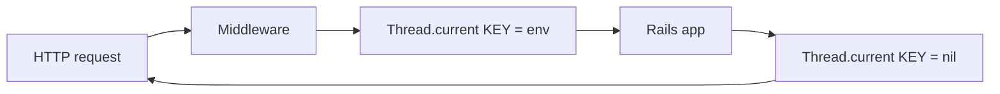
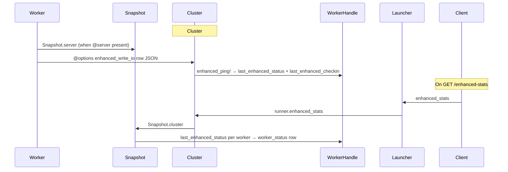
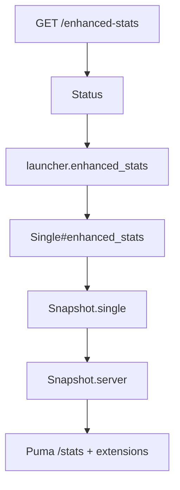
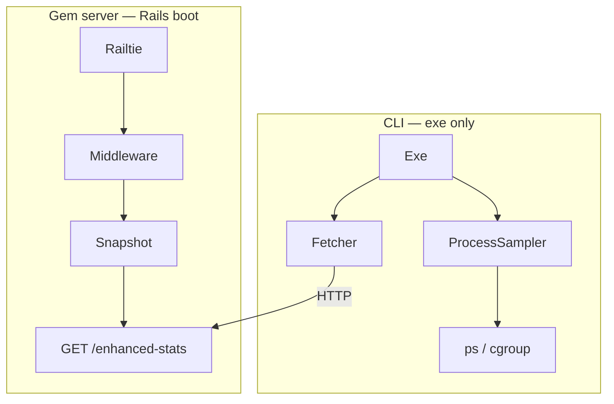

# Architecture

How **puma-enhanced-stats** integrates with Puma and Rails without modifying native Puma stats output.

## Components

| Component | Role |
|-----------|------|
| `Railtie` | Inserts `Middleware` innermost on the Rails stack |
| `Middleware` | Stores live Rack `env` in thread-local storage for the request duration |
| `Configuration` / `DSL` | Field extractors and truncation settings from `puma.rb` (`server.options[:enhanced_stats]`) |
| `Snapshot` | Builds Puma-aligned JSON via `server` / `single` / `cluster(workers:, phase:, started_at:)` |
| `WorkerHandle` | `@last_enhanced_checkin` + `@last_enhanced_status` via `enhanced_ping!` |
| `Launcher` | Delegates `enhanced_stats` → `@runner.enhanced_stats` |
| `Cluster` | `@enhanced_read_io` + reader thread; `@options[:enhanced_write_io]` for workers → `enhanced_ping!`; `Snapshot.cluster` aggregates worker `Snapshot.server` rows |
| `Worker` | Sender thread writes `Snapshot.server` when `@server` is present |
| `Single` | `Snapshot.single(server:)` when `@server` is present; zero-filled counters otherwise |
| `Status` | `GET /enhanced-stats` → `@launcher.enhanced_stats` |
| `ControlCLI` | Registers `pumactl enhanced-stats` |

Entry point: [lib/puma/enhanced/stats.rb](../lib/puma/enhanced/stats.rb) prepends `Puma::Launcher`, `Puma::Cluster`, `Puma::Cluster::WorkerHandle`, `Puma::Cluster::Worker`, and `Puma::Single` at load time.

## Request path (worker process)



The middleware stamps `env["puma.enhanced_stats.started_at"]` with `Time.now.iso8601(6)` on entry. No field extractors run on the request hot path.

Clear runs when the Rails stack returns from `@app.call`, not when a streaming body completes. See [Operations — Limitations](operations.md#limitations).

## Cluster sync path



The wire format is a **flat worker row** (`index`, `pid`, `stats`, `requests: []`). HTTP responses aggregate worker `Snapshot.server` rows via `last_enhanced_*`. See [ADR 0008](adr/0008-enhanced-stats-puma-aligned-json.md).

Enhanced stats travel on a **dedicated pipe**. The native `PIPE_PING` channel and `Puma::Cluster#stats` are untouched, so `pumactl stats` and `GET /stats` stay Puma-native.

## Single mode path



Single mode merges live `@server.stats` with `collected_at`, `requests`, and `requests_in_flight` at root when the server is running. Before `start_server`, `Single#enhanced_stats` returns zero-filled pool counters. No `worker_status` wrapper.

## Separation from native stats

| Endpoint / command | Content |
|--------------------|---------|
| `GET /stats`, `pumactl stats` | Puma-native stats only |
| `GET /enhanced-stats`, `pumactl enhanced-stats` | Puma `/stats` shape + flat gem extensions |
| `Puma.stats` / `Puma.stats_hash` | Native stats in-process (master or single) |
| `Puma.enhanced_stats` / `Puma.enhanced_stats_hash` | Enhanced payload in-process via `@runner` |

Integration tests assert `/stats` does not include `enhanced_stats`.

## In-flight tracking internals

- Storage: `Middleware` holds the live Rack `env` per busy worker thread (`Thread.current[KEY]`)
- Build: `Snapshot#server_row` reads thread-local envs and returns in-flight `requests` at read time (`Snapshot.server` requires a `Puma::Server` instance)
- Requests in the Puma `@todo` queue are not tracked until a thread executes the middleware

See [ADR 0007](adr/0007-lazy-snapshot-from-env.md).

## Failure handling

Middleware and snapshot building fail open — stats never break HTTP responses. Extractor errors during request snapshotting yield an empty `requests` array for that read.

Pipe parse/store errors are discarded (fail-open). Malformed wire lines never affect the cluster or native ping loop.

## Extension points (future)

The codebase is intentionally monolithic. Likely future additions (not implemented):

- Length-prefix framing for payloads larger than the pipe buffer (~64 KB)
- Terminal CLI (removed in 0.4.0; reintroduced on CLI branch — see [CLI TDD](cli/tdd.md))
- Body-close lifecycle for streaming accuracy

## Source layout

```
lib/puma/enhanced/stats/
  configuration.rb      # fields, truncation defaults
  dsl.rb                # enhanced_stats block
  middleware.rb
  snapshot.rb            # Snapshot.server / .single / .cluster
  cluster.rb             # pipe IO, dispatch enhanced_ping!
  worker_handle.rb       # last_enhanced_checkin, last_enhanced_status, enhanced_ping!
  worker.rb              # pipe writer (sender thread; skips until @server)
  single.rb              # Single#enhanced_stats, empty payload before @server
  status.rb             # GET /enhanced-stats
  launcher.rb           # enhanced_stats delegation
  railtie.rb
  field.rb
  version.rb
```

## Terminal CLI (standalone)

The interactive dashboard (`puma-enhanced-stats`) is **not** loaded with the gem server path. It lives under `lib/puma/enhanced/stats/cli/` and is required only from executables ([ADR 0001](adr/0001-cli-load-isolated-from-rails.md)).



| Surface | Loads CLI? | Output |
|---------|------------|--------|
| Rails app with gem | No | JSON via HTTP only |
| `bundle exec puma-enhanced-stats` | Yes | TUI dashboard |
| `pumactl enhanced-stats` | No | JSON to stdout |

Full design: [cli/tdd.md](cli/tdd.md). Visual spec: [cli/ui-spec.md](cli/ui-spec.md).
