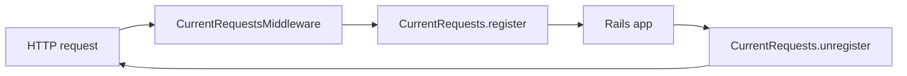
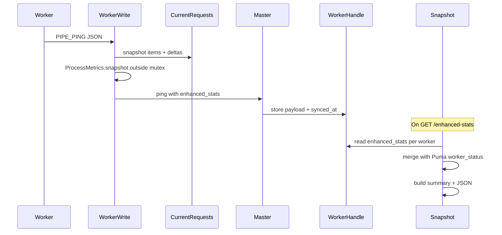
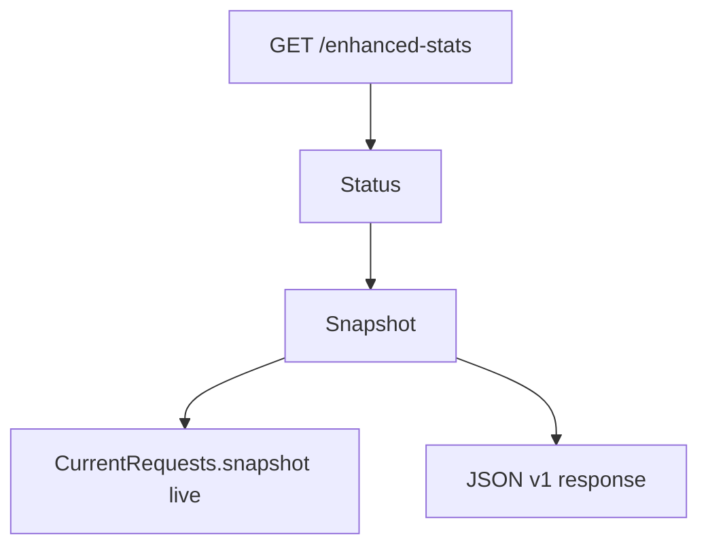

# Architecture

How **puma-enhanced-stats** integrates with Puma and Rails without modifying native Puma stats output.

## Components

| Component | Role |
|-----------|------|
| `Railtie` | Inserts `CurrentRequestsMiddleware` innermost on the Rails stack |
| `CurrentRequestsMiddleware` | `register` on entry, `unregister` in `ensure` |
| `CurrentRequests` | Thread-safe in-flight registry (Singleton per worker) |
| `Configuration` / `DSL` | Limits, policies, field extractors from `puma.rb` |
| `Launcher` | Assigns config at boot; `reset!` on `before_worker_boot` (cluster) |
| `ClusterWorker` + `WorkerWrite` | Decorates worker pipe; merges registry into PIPE_PING |
| `WorkerHandle` | Master stores latest `enhanced_stats` from each ping |
| `Snapshot` | Builds JSON v1 from launcher stats + worker enhanced payloads |
| `Status` | Serves `GET /enhanced-stats` on the control app |
| `ControlCLI` | Registers `pumactl enhanced-stats` |

Entry point: [lib/puma/enhanced/stats.rb](../lib/puma/enhanced/stats.rb) prepends Puma modules at load time.

## Request path (worker process)



Field extraction for registry entries runs **outside** the registry mutex where possible; capacity checks run again before insert.

Unregister runs when the Rails stack returns from `@app.call`, not when a streaming body completes. See [Operations — Limitations](operations.md#limitations).

## Cluster sync path



Enhanced stats travel **inside** the existing worker ping channel. The master does **not** mutate `Puma::Cluster#stats`, so `pumactl stats` and `GET /stats` stay Puma-native.

## Single mode path



No worker ping cache. `synced_at` on the single worker row equals `meta.collected_at`.

## Separation from native stats

| Endpoint / command | Content |
|--------------------|---------|
| `GET /stats`, `pumactl stats` | Puma-native stats only |
| `GET /enhanced-stats`, `pumactl enhanced-stats` | JSON v1 with in-flight requests + process metrics |

Integration tests assert `/stats` does not include `enhanced_stats`.

## Registry internals

- Storage: `Hash` keyed by `action_dispatch.request_id` (insertion order preserved)
- Policies: `:keep_longest` evicts newest key when full; `:reject_new` drops new registrations
- Snapshot: returns `items`, interval `dropped_count` / `truncated`, then samples `process` via `/proc` **outside** the mutex (since 0.4.2)

## Failure handling

Registry and middleware operations rescue `StandardError` and fail open — stats never break HTTP responses. Misconfigured extractors fail silently; validate DSL in staging.

Worker ping enhancement falls back to the original message if JSON parse fails ([WorkerWrite](../lib/puma/enhanced/stats/worker_write.rb)).

## Extension points (future)

The codebase is intentionally monolithic. Likely future additions (not implemented):

- Optional terminal CLI (removed in 0.4.0)
- Additional limit policies
- Body-close lifecycle for streaming accuracy

## Source layout

```
lib/puma/enhanced/stats/
  configuration.rb      # limits, fields, defaults
  dsl.rb                # enhanced_stats block
  current_requests.rb   # registry singleton
  current_requests_middleware.rb
  process_metrics.rb    # /proc sampling (Linux)
  snapshot.rb           # JSON assembly
  status.rb             # control route
  launcher.rb           # boot hooks
  worker_write.rb       # cluster pipe + ClusterWorker prepend
  worker_handle.rb      # master cache
  railtie.rb
  field.rb
  version.rb
```

## Related docs

- [JSON contract](json-contract.md)
- [Operations](operations.md)
- [CONTRIBUTING](../CONTRIBUTING.md)
