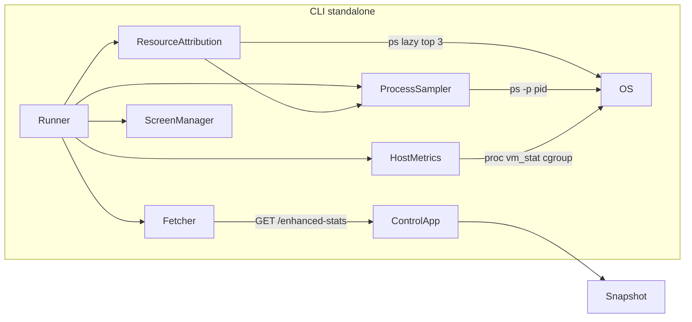

# CLI technical design (TDD)

Technical design for the **`puma-enhanced-stats`** terminal dashboard, target gem **0.6.0**.

- **Visual behavior:** [ui-spec.md](ui-spec.md)
- **Decisions:** [ADRs](../adr/README.md)
- **HTTP payload:** [JSON contract](../json-contract.md) + [schema v1](../../schema/enhanced-stats-v1.json)

The CLI is a **pure consumer** of `GET /enhanced-stats`. It does not change the server or schema.

---

## Overview



- Loading: [`require "puma/enhanced/stats/cli"`](../lib/puma/enhanced/stats/cli.rb) **only** in executables ([ADR 0001](../adr/0001-cli-load-isolated-from-rails.md)).
- `pumactl enhanced-stats` remains for scripted/JSON output without TUI.

Executables:

| Binary | Role |
|--------|------|
| `puma-enhanced-stats` | Interactive dashboard |
| `puma-enhanced-stats-stub` | Fake control app for local dev |

---

## Data contract

Source: [json-contract.md](../json-contract.md), [enhanced-stats-v1.sample.json](../../spec/fixtures/enhanced-stats-v1.sample.json).

### From JSON (`Fetcher`)

| Section | Fields |
|---------|--------|
| `meta` | `collected_at`, `gem_version`, `puma_version`, `ruby_version`, `mode`, `worker_check_interval_seconds` |
| `summary` | 10 schema fields; UI renders **7 lines** ([ui-spec — SUMMARY](ui-spec.md#summary)) |
| `workers[]` | `index`, `pid`, `synced_at`, `puma`, `requests` — **no `process`** |
| `requests.items[]` | `id`, `started_at`, `session` required; others via DSL |

### Enriched by CLI (not in JSON)

| Display | Source |
|---------|--------|
| `elapsed` | `Format.elapsed(collected_at, started_at)` |
| Worker `rss` / `cpu` | `ProcessSampler.sample(pid)` |
| PROCESSES `%CPU`, `%MEM`, RSS | `ProcessSampler.sample_pids` batch |
| TOP load, CPU, mem, swap | `HostMetrics.read` |
| Puma share, gap, outsiders | `ResourceAttribution.compute` ([ADR 0005](../adr/0005-host-vs-puma-resource-attribution.md)) |
| Master row `M` in PROCESSES | `Fetcher#master_pid` from state file (`-S`) |

### Intervals and stale workers

- Poll interval: `meta.worker_check_interval_seconds`; if `0` (single mode), fallback **5s**.
- `synced_at` freshness: [ui-spec — sync freshness](ui-spec.md#worker-sync-freshness); implemented as `SyncFreshness` (LabelLine, no bar).
- Single mode: `synced_at == collected_at`; sync badges typically `ok`.

---

## Module layout

```
lib/puma/enhanced/stats/cli.rb
lib/puma/enhanced/stats/cli/
  runner.rb              # argv, watch loop, exit codes
  options.rb             # flags + runtime state
  user_config.rb         # ~/.pesrc load/save
  control_discovery.rb   # flags → puma.rb → state file
  state_file.rb          # parse YAML Puma state
  fetcher.rb             # GET /enhanced-stats
  terminal.rb            # winsize, SIGWINCH, alternate screen, clear, TTY?
  keyboard.rb            # non-blocking stdin
  scroll_state.rb        # request/worker offsets (ADR 0004)
  screen_manager.rb      # dashboard | modals
  design_screen.rb
  sort_screen.rb
  filter_screen.rb
  help_content.rb        # static text per tab
  help_screen.rb         # ?/h modal
  layout_registry.rb     # 6 frame modes + fallback
  layout_budget.rb       # rows/cols budget
  box.rb, bar.rb, colors.rb, format.rb
  metric_line.rb, label_line.rb
  sync_freshness.rb
  alert_level.rb
  host_metrics.rb
  cgroup_memory.rb       # MemoryCapacity.total
  process_sampler.rb
  resource_attribution.rb
  header_renderer.rb
  top_renderer.rb        # TOP + PROCESSES + Puma suffix
  outsiders_renderer.rb
  summary_renderer.rb
  worker_renderer.rb
  footer_renderer.rb
  severity_sorter.rb
  request_field_catalog.rb
  request_enricher.rb
  request_filter.rb
  request_sorter.rb
  request_pipeline.rb
  request_table.rb
  stub_server.rb
  stub_payload_builder.rb
  stub_scenarios.rb
```

Port from git tag **`v0.3.0`** where applicable: `ControlDiscovery`, `Fetcher`, `StateFile`, `HostMetrics`, base TUI primitives.

---

## Watch loop

```ruby
Terminal.enter_alternate_screen! if watch? && tty?

begin
  loop do
    payload = fetcher.fetch if poll_due? || keyboard.refresh?
    scroll_state.clamp!(payload)
    process_by_pid = ProcessSampler.sample_all(
      payload["workers"], master_pid: fetcher.master_pid
    )
    host = HostMetrics.read
    attribution = ResourceAttribution.compute(
      host: host,
      puma_pids: process_by_pid.keys,
      process_by_pid: process_by_pid
    )
    attribution.load_outsiders! if options.show_outsiders? || attribution.warn_or_crit?
    frame = screen.render(
      payload, host: host, process: process_by_pid,
      attribution: attribution, scroll: scroll_state
    )
    Terminal.clear if watch? && tty?
    print frame
    break unless watch?
    screen.handle(keyboard.read(deadline: next_poll))
  end
ensure
  Terminal.leave_alternate_screen! if watch? && tty?
end
```

Poll deadline: `worker_check_interval_seconds` from payload, else **5**. Scroll keys update `ScrollState` without zeroing on poll ([ADR 0004](../adr/0004-scroll-state-and-alternate-screen.md)).

---

## Scroll and refresh

See [ui-spec — scroll](ui-spec.md#scroll-and-refresh) for UX; behavior summary:

| Mechanism | Behavior |
|-----------|----------|
| Alternate screen | `\e[?1049h` on watch enter; restore on exit |
| `ScrollState` | `request_offset[worker]`, `worker_offset`, `focus_worker` |
| Clamp | After fetch, `offset = min(offset, max(0, count - page_size))` |
| Keys | `j`/`k` line; `[`/`]` page; worker scroll `J`/`K` optional |
| Persistence | Session only — **not** in `~/.pesrc` |
| Modals | Dashboard not redrawn; offsets preserved |

---

## ResourceAttribution

Detects whether host CPU/memory pressure is explained by Puma PIDs.

**Inputs:** `HostMetrics` snapshot + `ProcessSampler` samples for all Puma PIDs (workers + master).

| Metric | Calculation |
|--------|-------------|
| `puma_cpu` | Sum `%cpu` of Puma PIDs |
| `puma_rss` | Sum `rss_bytes` of Puma PIDs |
| `host_cpu` | Host CPU usage % |
| `host_mem` | Host memory used/total/ratio |
| `cpu_gap` | `host_cpu - puma_cpu` (clamp ≥ 0) |
| `mem_gap_ratio` | `host_mem.ratio - (puma_rss / host_mem.total)` |

**Warn/crit triggers (approximate):**

- Warn: host CPU > 75% and puma_cpu < 40% and cpu_gap ≥ 30pp; or memory ratio mismatch per ui-spec.
- Crit: warn + (cpu_gap ≥ 50 or swap ratio > 50%).

**Outsiders:** lazy `ps -eo pid,pcpu,pmem,rss,comm --sort=-pcpu`, exclude known Puma PIDs, take top 3.

**Degraded:** CLI on host, Puma remote → omit attribution; PROCESSES show `—`.

---

## MemoryCapacity (cgroup)

`CgroupMemory` resolves total bytes for RSS % and TOP memory bar:

1. cgroup v2 `memory.max`
2. cgroup v1 `memory.limit_in_bytes` (if finite)
3. Linux `/proc/meminfo` `MemTotal`
4. macOS `hw.memsize`

Used by `HostMetrics` and `ProcessSampler` ratio denominators. See [Operations — CLI and Docker](operations.md#terminal-cli-and-docker).

Optional future override: `PES_MEM_TOTAL_BYTES` (not MVP).

---

## CLI flags

| Flag | Effect |
|------|--------|
| `--help`, `-h` | Flags, connection; note: *In watch mode, press ? for field reference* |
| *(default)* | Watch mode on |
| `--no-watch` | Single snapshot, stdout |
| `--no-top` | Hide TOP **and** PROCESSES |
| `--sort FIELD` | `cpu`, `rss`, `backlog`, `index` — PROCESSES + worker boxes; default **severity** |
| `--no-color` | No ANSI |
| `--json` | Raw JSON, no TUI, no process enrichment |
| `--filter F=V` | Initial filter (repeatable) |
| `--layout MODE` | Initial frame layout |
| `--request-display MODE` | `auto` \| `inline` \| `stack` |
| `--no-rc` | Ignore `~/.pesrc` |
| `-w COLS` | Fixed width (tests) |
| `-S`, `-C`, `-T`, `-F` | Connection (pumactl style) |

**Precedence:** defaults → `~/.pesrc` → CLI flags. Connection: flags → `config/puma.rb` via `Puma::Configuration` → state file overrides URL/token/PID.

---

## User config (`~/.pesrc`)

Format `key=value`. Override path: env `PESRC`.

| Key | Purpose |
|-----|---------|
| `frame_layout` | stacked, two_column, split, grid, focus, compact |
| `request_display` | auto, inline, stack |
| `show_top` | TOP + PROCESSES |
| `show_outsiders` | OUTSIDE PUMA panel |
| `sort.process` | process table sort field |
| `sort.field` / `sort.dir` | request sort |
| `filter.*` | active filters |
| `focus_worker` | last focused worker index |

Tecla **`W`** saves dirty prefs.

---

## Stub server

HTTP fake control app; no Puma/Rails. Payload matches schema v1 (no `process`).

```bash
# Terminal 1
bundle exec puma-enhanced-stats-stub --workers 3 --stale 1 --scenario mixed

# Terminal 2
bundle exec puma-enhanced-stats -C tcp://127.0.0.1:9293 -T dev
```

Fixtures: `spec/fixtures/stub/{mixed-cluster,stale-worker,truncated-paths}.json`

Scenario `mixed`: 3 workers, long paths, multi-field session, stale/null sync, `truncated: true`.

---

## Out of scope (0.6.0)

- Sparklines / history between polls
- Schema or server changes
- `tty-screen`, `curses` / `ncurses` ([ADR 0003](../adr/0003-stdlib-tui-without-curses.md))
- Loading CLI on Rails boot ([ADR 0001](../adr/0001-cli-load-isolated-from-rails.md))
- Full-system process browser (outsiders capped at 3)

---

## Implementation order

Use this sequence when writing code; each step should have specs before the next renderer layer.

1. **Packaging + infra** — gemspec (`bindir`, `pastel`), `exe/`, `Options`, `UserConfig`, `ControlDiscovery`, `StateFile`, `Fetcher`
2. **ProcessSampler + HostMetrics** — `CgroupMemory`, `ResourceAttribution`
3. **TUI primitives** — `Terminal`, `Keyboard`, `Box`, `Bar`, `MetricLine`, `LabelLine`, `LayoutBudget`
4. **Stub early** — `StubServer`, fixtures (unblocks dev without real Puma)
5. **Request pipeline** — enricher, filter, sorter, `RequestTable`
6. **Renderers + layouts** — six modes; [ui-spec.md](ui-spec.md) is acceptance criteria
7. **Modals + Runner** — `ScreenManager`, Help, watch loop, keys
8. **Specs → 100% coverage** — project requires full line+branch coverage
9. **README + CHANGELOG** — operational quick start only
10. **Release 0.6.0** — bump `version.rb`

Critical test asserts (from ui-spec):

```ruby
expect(render(width: 200, request_display: :inline)).not_to include("└ method:")
expect(render(width: 55)).to include("└ path_info:")
expect(render(width: 55, frame_layout: :compact)).to match(/rep….*└ path_info:/m)
```

Command: `COVERAGE=true bundle exec rake spec:coverage`

---

## Related

- [CLI index](README.md)
- [UI spec](ui-spec.md)
- [Architecture — terminal CLI](../architecture.md#terminal-cli-standalone)
