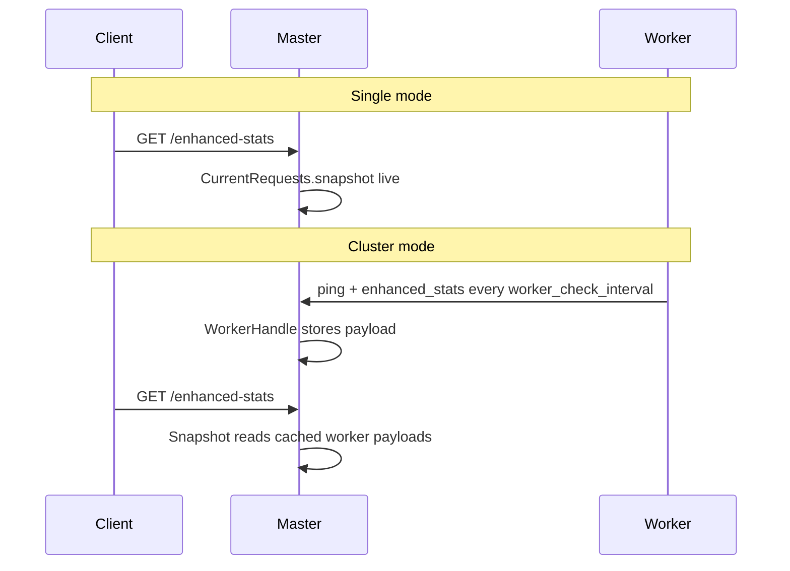

# JSON contract (schema v1)

The enhanced-stats payload is defined by [schema/enhanced-stats-v1.json](../schema/enhanced-stats-v1.json) and validated in CI via [spec/contract/enhanced_stats_v1_spec.rb](../spec/contract/enhanced_stats_v1_spec.rb).

A full sample lives at [spec/fixtures/enhanced-stats-v1.sample.json](../spec/fixtures/enhanced-stats-v1.sample.json).

## Top-level shape

| Key | Type | Description |
|-----|------|-------------|
| `schema_version` | integer | Always `1` for this contract |
| `meta` | object | Collection metadata (timestamp, versions, mode) |
| `summary` | object | Cluster-wide aggregates |
| `workers` | array | One object per worker (or one synthetic row in single mode) |

## `meta`

| Field | Description |
|-------|-------------|
| `collected_at` | UTC ISO 8601 time when `Snapshot#build` ran on the master |
| `gem_version` | `Puma::Enhanced::Stats::VERSION` |
| `puma_version` | Running Puma version |
| `ruby_version` | Running Ruby version |
| `mode` | `"single"` or `"cluster"` |
| `worker_check_interval_seconds` | Value from Puma `worker_check_interval` in `config/puma.rb` (cluster); reflects configured ping interval |

In **single** mode, enhanced data is read live from the in-flight registry when you query `/enhanced-stats`.

In **cluster** mode, worker rows reflect the **last worker ping** that carried `enhanced_stats`. Freshness is indicated by each worker's `synced_at` (see below).

## `summary`

Aggregates across all workers in the response:

| Field | Description |
|-------|-------------|
| `workers_total` | Number of worker rows |
| `workers_reporting` | Workers with non-null `synced_at` (cluster) |
| `workers_stale` | `workers_total - workers_reporting` |
| `requests_in_flight` | Sum of `workers[].requests.meta.count` |
| `requests_dropped_total` | Sum of per-worker `dropped_count` deltas |
| `requests_truncated` | `true` if any worker reported field truncation in the interval |
| `backlog_total` | Sum of `workers[].puma.backlog` |
| `busy_threads_total` | Sum of `workers[].puma.busy_threads` |
| `max_threads_total` | Sum of `workers[].puma.max_threads` |
| `pool_capacity_total` | Sum of `workers[].puma.pool_capacity` |

Use `summary` for dashboards; drill into `workers[]` for per-process detail.

## `workers[]`

| Field | Description |
|-------|-------------|
| `index` | Worker index (0 in single mode) |
| `pid` | OS process id |
| `synced_at` | UTC ISO 8601 time of the last cluster ping that stored enhanced stats; `null` until the first ping. In single mode, equals `meta.collected_at` |
| `puma` | Thread-pool counters from `Puma::Server::STAT_METHODS` |
| `process` | `rss_bytes`, `cpu_percent` from `/proc` on Linux; `null` elsewhere |
| `requests` | In-flight registry snapshot for this worker |

### `workers[].puma`

Mirrors Puma native stats: `backlog`, `running`, `pool_capacity`, `busy_threads`, `backlog_max`, `max_threads`, `requests_count`, `reactor_max`.

These values come from Puma's worker status, **not** from the enhanced registry. `GET /stats` and `pumactl stats` remain unchanged.

### `workers[].process`

| Field | Description |
|-------|-------------|
| `rss_bytes` | Resident set size in bytes |
| `cpu_percent` | CPU usage since the previous snapshot (top-style interval; `null` on first sample) |

Sampled via `/proc` on Linux when the worker builds its ping payload (cluster) or when `/enhanced-stats` is read (single). Sampling runs **outside** the registry mutex (since 0.4.2). First snapshot returns `cpu_percent: null`.

### `workers[].requests`

#### `requests.meta`

| Field | Description |
|-------|-------------|
| `count` | Current in-flight entries |
| `request_limit` | Configured registry cap |
| `limit_policy` | `"keep_longest"` or `"reject_new"` |
| `truncated` | Whether any field was truncated since the **previous** snapshot/ping |
| `dropped_count` | Registrations rejected or evicted since the **previous** snapshot/ping |

**Delta semantics:** `dropped_count` and `truncated` are interval counters, not lifetime totals. They reset after each worker ping (cluster) or each `CurrentRequests#snapshot` read (single).

#### `requests.items[]`

Each in-flight request entry:

| Field | Required | Description |
|-------|----------|-------------|
| `id` | yes | `action_dispatch.request_id` |
| `started_at` | yes | UTC ISO 8601 time at registration |
| `method`, `path_info`, `remote_ip` | no* | Default built-in request fields (present with zero-config) |
| `session` | yes | Nested hash of configured session fields; always `{}` when none are configured |
| *(custom)* | no | Additional top-level keys from `request` extractors |

\*Default request fields are always populated unless you replace them in the DSL.

Custom field names are allowed (`additionalProperties: true` on request items). Values are strings truncated to `max_field_length` with optional `truncate_suffix`.

There is **no** `elapsed_ms` in v1; compute duration client-side from `started_at` and `meta.collected_at` if needed.

## Single vs cluster freshness



In cluster mode, in-flight items may be up to one `worker_check_interval` stale relative to the worker process. Compare `synced_at` with `meta.collected_at` and watch `workers_stale`.

## Querying

```bash
curl "http://127.0.0.1:9293/enhanced-stats?token=SECRET"
bundle exec pumactl -S tmp/puma.state enhanced-stats
```

Invalid or missing `token` returns **403 Forbidden** (same as other control app routes).

## Schema changes

Any contract change requires:

1. Update [schema/enhanced-stats-v1.json](../schema/enhanced-stats-v1.json)
2. Update [spec/fixtures/enhanced-stats-v1.sample.json](../spec/fixtures/enhanced-stats-v1.sample.json)
3. Extend [spec/contract/enhanced_stats_v1_spec.rb](../spec/contract/enhanced_stats_v1_spec.rb)
4. Document here and in [CHANGELOG](../CHANGELOG.md)
